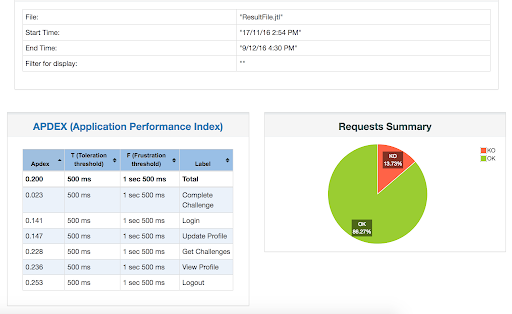
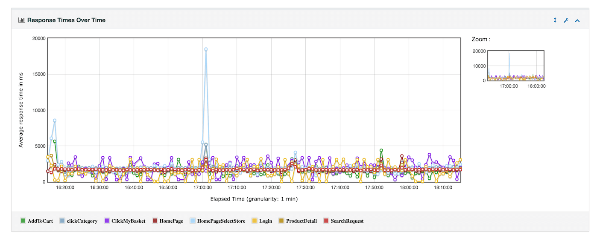

# Jmeter Distributed Load testing automation with Jenkins

For  understanding this github repo every individual needs to know load testing, jmeter tool, jmeter distributed setup, jenkins CI and bash script 

### Why do we need
While we want to load testing  our services, firstly we create load test scenario(jmeter jmx file) on our local enviroment and then we copy this jmx script with it's dependencies(files or parsed files for distributed env) to master jmeter server. After copy finished to master server the following step is to  move these  files or parsed files to jmeter slaves from master server  because slave servers need to see these files on their locals.  After executing  jmeter.sh with remote slave ips and jmx path in master server, we are getting html report dashborad for result analysis .  These dashboards are distributed to the interested persons. 
Above mentioned steps for load testing is very time consuming and  tedious task for different projects. These steps should be automated completely.

### How does it work: 
We create jmeter jmx  script with it's dependencies in our local env. By pushing our code to bitbucket,  trigger fires up and call  jenkins multibranch pipeline api.(repo branch names are appropriate for different projects in our example). Then jenkins job logins  ssh passwordless to jmeter master and executing "executejmeter.sh branchname jmxfilename" script. Load test report url generated and by clicking on the url you will see  report. Script defination is noted as comment in script file. 

### Example Report Home  UI 

### Example Service ResponseTime UI 

### Requirements: 
Jmeter Distributed Load Test enviroment  
Jmeter master server login ssh passwordless to jmeter slave servers  
Jenkins server ssh key based login to jmeter  master  
Bitbucket and Jenkins Integration  

Have fun :) 